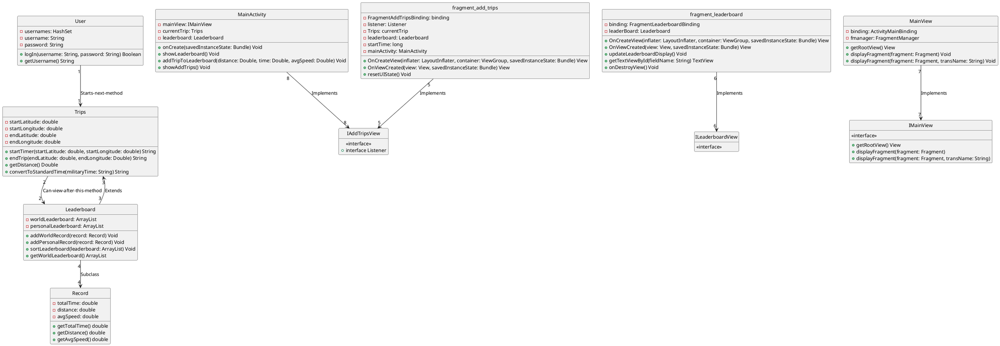

we have a state weather case but don't find it important.
# 1. Class Diagram Model

```plantuml
' skinparam classAttributeIconSize 0

@startuml
hide circle
hide empty methods

' classes

   class User {
        -usernames: HashSet
        -username: String
        -password: String
        +logIn(username: String, password: String) Boolean
        +getUsername() String
    }

    class Trips {
        -startLatitude: double
        -startLongitude: double
        -endLatitude: double
        -endLongitude: double
        +startTimer(startLatitude: double, startLongitude: double) String
        +endTrip(endLatitude: double, endLongitude: Double) String
        +getDistance() Double
        +convertToStandardTime(militaryTime: String) String
    }

    class Leaderboard {
        -worldLeaderboard: ArrayList
        -personalLeaderboard: ArrayList
        +addWorldRecord(record: Record) Void
        +addPersonalRecord(record: Record) Void
        +sortLeaderboard(leaderboard: ArrayList) Void
        +getWorldLeaderboard() ArrayList
    }

    class Record {
        -totalTime: double
        -distance: double
        -avgSpeed: double
        +getTotalTime() double
        +getDistance() double
        +getAvgSpeed() double
    }

    class MainActivity {
        -mainView: IMainView
        -currentTrip: Trips
        -leaderboard: Leaderboard
        +onCreate(savedInstanceState: Bundle) Void
        +showLeaderboard() Void
        +addTripToLeaderboard(distance: Double, time: Double, avgSpeed: Double) Void
        +showAddTrips() Void
    }

    class fragment_add_trips {
        -FragmentAddTripsBinding: binding
        -listener: Listener
        -Trips: currentTrip
        -leaderboard: Leaderboard
        -startTime: long
        -mainActivity: MainActivity
        +OnCreateView(inflater: LayoutInflater, container: ViewGroup, savedInstanceState: Bundle) View
        +OnViewCreated(view: View, savedInstanceState: Bundle) View
        +resetUIState() Void
    }

    class fragment_leaderboard {
        -binding: FragmentLeaderboardBinding
        -leaderBoard: Leaderboard
        +OnCreateView(inflater: LayoutInflater, container: ViewGroup, savedInstanceState: Bundle) View
        +OnViewCreated(view: View, savedInstanceState: Bundle) View
        +updateLeaderboardDisplay() Void
        +getTextViewById(fieldName: String) TextView
        +onDestroyView() Void
    }

    class MainView {
        -binding: ActivityMainBinding
        -fmanager: FragmentManager
        +getRootView() View
        +displayFragment(fragment: Fragment) Void
        +displayFragment(fragment: Fragment, transName: String) Void
    }

    class IMainView {
        <<interface>>
        +getRootView() View
        +displayFragment(fragment: Fragment)
        +displayFragment(fragment: Fragment, transName: String)
    }

    class ILeaderboardView {
        <<interface>>
    }

    class IAddTripsView {
        <<interface>>
        +interface Listener
    }

    User "1" --> "1" Trips : Starts-next-method
    Trips "2" --> "2" Leaderboard : Can-view-after-this-method
    Leaderboard "3" --> "3" Trips : Extends
    Leaderboard "4" --> "4" Record : Subclass
    fragment_add_trips "5" --> "5" IAddTripsView : Implements
    fragment_leaderboard "6" --> "6" ILeaderboardView : Implements
    MainView "7" --> "7" IMainView : Implements
    MainActivity "8" --> "8" IAddTripsView : Implements


@enduml
```
