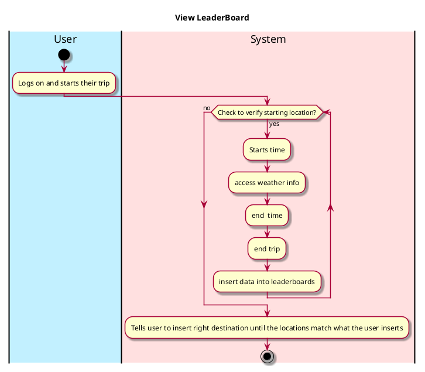
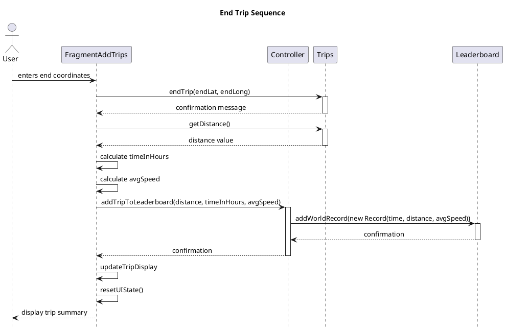

# Use case name, e.g., end trip

## 1. Primary actor and goals

the user ending their drive, marking the end point of the drive and also ending the timer.

## 2. Other stakeholders and their goals

Friends making sure that the avg speeds are accurate.

## 2. Preconditions

The start drive must have been completed, the weather conditions must have been recorded, the timer is still active and
their have been no failures on behalf of the app.

## 3. Postconditions

What must be true upon successful completion of the use case.

end time is saved and logged,
end time along with start time are used to calculate total time of the trip.

## 4. Workflow

The sequence of steps involved in the execution of the use case, in the form of one or more activity diagrams (please feel free to decompose into multiple diagrams for readability).

The workflow can be specified at different levels of detail:

* __Brief__: User inputs the location of their final destination after having started the trip;
* __Casual__: User inputs end location once they have reached their destination;
* __Fully-dressed__: User inputs their ending location in order for the end time to be marked and recorded so that stats can be created based on the trip information.

Please be sure indicate what level of detail the workflow you include represents.

## 5. Sequence Diagram

