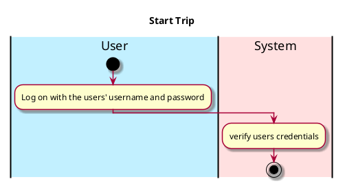

# Use case name, e.g., Log on


## 4. Happy Workflow


The sequence of steps involved in the execution of the use case, in the form of one or more activity diagrams (please feel free to decompose into multiple diagrams for readability).


The workflow can be specified at different levels of detail:


* __Brief__: User logs on with proper authentication;
* __Casual__: User inputs their username and password;
* __Fully-dressed__: User inputs their username and password and then is taken to the home screen where they can start their drive.


Please be sure indicate what level of detail the workflow you include represents.



//


[//]: # (## 5. Sequence Diagram)


[//]: # ()
[//]: # ()
[//]: # (```plantuml)


[//]: # (@startuml)


[//]: # (hide footbox)


[//]: # (participant ": AppUI" as appui)


[//]: # (participant ": Controller" as controller)


[//]: # ()
[//]: # ([o->appui : input username)


[//]: # (appui -> controller : getUserName&#40;&#41;)


[//]: # (controller->appui : change display to ask for password)


[//]: # ([o<-appui : input password)


[//]: # (appui -> controller : getPassword&#40;&#41;)


[//]: # (controller-> appui : change display and enter main screen)


[//]: # ()
[//]: # ()
[//]: # (@enduml)


[//]: # (```)


