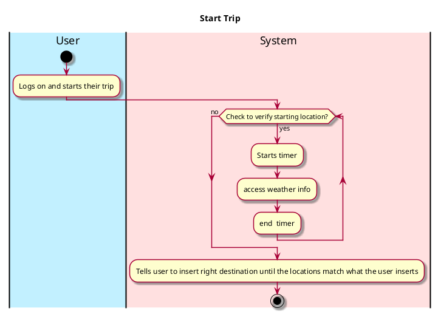
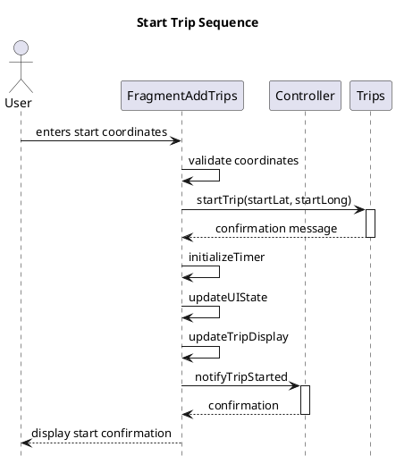

# Use case name, e.g., start trip

## 1. Primary actor and goals
Who is the main interested party and what goal(s) this use case is designed to help them achieve.
The user who is interested in gathering statistics on their drives, mark starting location and begin timer

## 2. Other stakeholders and their goals

Friends making sure that the avg speeds are accurate.
## 2. Preconditions

The user is identified and verifying the starting location.

## 4. Postconditions

What must be true upon successful completion of the use case.

Timer duration starts
Time/ weather conditions are logged

## 4. Workflow

The sequence of steps involved in the execution of the use case, in the form of one or more activity diagrams (please feel free to decompose into multiple diagrams for readability).

The workflow can be specified at different levels of detail:

* __Brief__: the user begins a drive and inputs their starting location(latitude and alongitude);
*
* __Casual__: most common scenarios and variations;
* __Fully-dressed__: all scenarios and variations.

Please be sure indicate what level of detail the workflow you include represents.

# 5. Sequence Diagram

