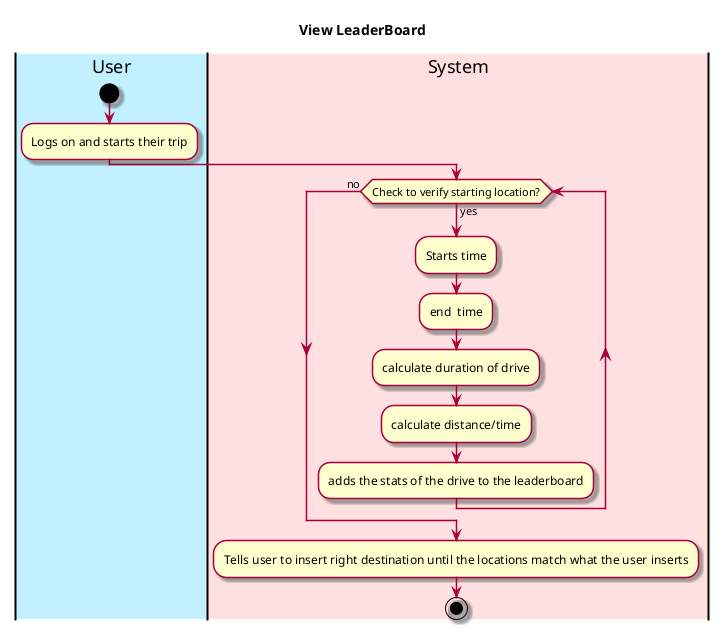
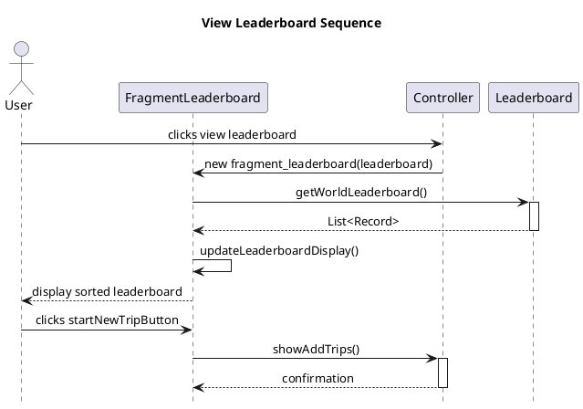

# Use case name, e.g., view leaderboard

## 1. Primary actor and goals
Who is the main interested party and what goal(s) this use case is designed to help them achieve.

the user that wants to compare who has the fastest avg speed(distance/time), attempting to beat their fastest time.

## 2. Other stakeholders and their goals

Friends making sure that the avg speeds are accurate.

## 2. Preconditions
the user's identity is verified
the user has properly completed a drive so that the stats could be added to the leaderboard.

## 4. Postconditions

The top 10 fastest avg speeds are posted on the leaderboard for all users to see.

## 4. Workflow

The sequence of steps involved in the execution of the use case, in the form of one or more activity diagrams (please feel free to decompose into multiple diagrams for readability).

The workflow can be specified at different levels of detail:

* __Brief__: user views the top 10 fastest avg speeds among all the user across the app.
* __Casual__: users click view leaderboard upon opening the app in order to check the best avg speeds that they have on the app.
* __Fully-dressed__: users check the leaderboard when they open the app, or after a trip, in order to view the top 10 fastest avg speeds that there are recorded on the app.

Please be sure indicate what level of detail the workflow you include represents.

## 5. Sequence Diagram

